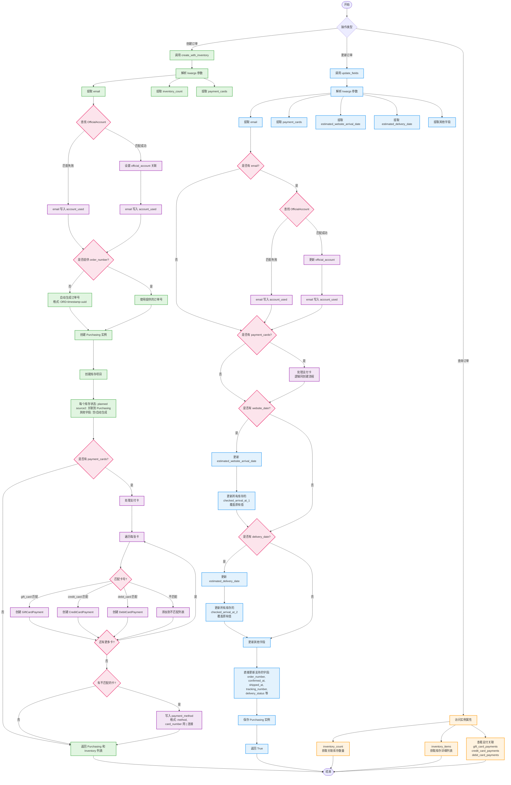
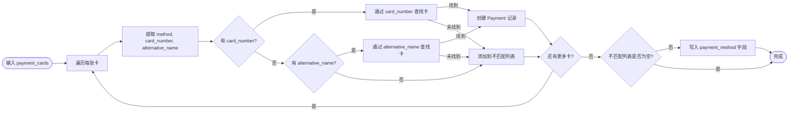
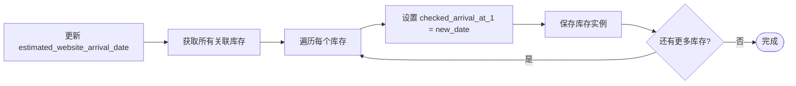
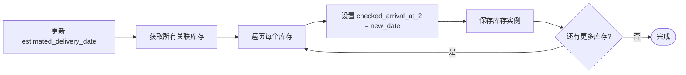
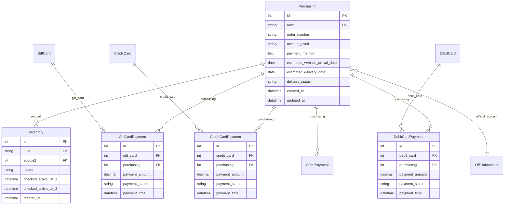

# Purchasing 模型操作流程图

## 总览

本文档展示了 Purchasing（采购订单）模型的完整操作流程，包括创建、更新和查询功能。

---

## 完整操作流程图



---

## 1. 创建流程 (create_with_inventory)

### 功能概述
创建 Purchasing 订单并自动创建关联的库存项目。

### 输入参数
```python
Purchasing.create_with_inventory(
    email='user@example.com',           # 可选：官方账号邮箱
    inventory_count=3,                   # 可选：库存数量，默认 1
    payment_cards=[                      # 可选：支付卡列表
        {'method': 'gift_card', 'card_number': 'CARD123', 'amount': '100'},
        {'method': 'credit_card', 'card_number': '1234567890123456', 'amount': '200'},
        {'method': 'gift_card', 'alternative_name': 'CARD-1-1', 'amount': '100'},  # 使用别名
        {'method': 'debit_card', 'alternative_name': 'DEBIT-1-1', 'amount': '150'}  # 使用别名
    ],
    order_number='CUSTOM-001',           # 可选：自定义订单号
    delivery_status='pending_confirmation',  # 可选：其他字段
    **kwargs                             # 其他 Purchasing 字段
)
```

### 处理步骤

1. **解析参数**
   - 提取 `email`、`inventory_count`、`payment_cards`
   - 其余参数作为 Purchasing 字段

2. **查找官方账号**
   - 根据 email 查找 OfficialAccount
   - 匹配成功：设置 `official_account` 关联
   - 无论是否匹配：email 写入 `account_used`

3. **生成订单号**
   - 如果未提供 `order_number`：自动生成
   - 格式：`ORD-{timestamp}-{random_suffix}`

4. **创建 Purchasing 实例**
   - 使用所有提供的字段创建订单

5. **创建库存项目**
   - 创建指定数量的 Inventory
   - 每个库存：
     - `source2`: 关联到 Purchasing
     - `status`: 'planned'（计划中）
     - 其他字段：空或自动生成

6. **处理支付卡**（如果提供）
   - 遍历每张卡，尝试匹配：
     - `gift_card` → GiftCard（通过 card_number 或 alternative_name）
     - `credit_card` → CreditCard（通过 card_number 或 alternative_name）
     - `debit_card` → DebitCard（通过 card_number 或 alternative_name）
   - 匹配规则：
     - 优先通过 `card_number` 查找
     - 如果没有 `card_number`，则通过 `alternative_name` 查找
   - 匹配成功：创建对应的 Payment 中间表记录
   - 匹配失败：添加到不匹配列表
   - 不匹配的卡写入 `payment_method` 字段
     - 格式：`(method, identifier)|(method2, identifier2)`

### 返回值
```python
(purchasing_instance, [inventory_list])
```

### 事务保证
使用 `@transaction.atomic` 确保原子性，要么全部成功，要么全部回滚。

---

## 2. 更新流程 (update_fields)

### 功能概述
更新 Purchasing 实例字段，并同步更新相关库存信息。

### 输入参数
```python
purchasing_instance.update_fields(
    email='new@example.com',             # 可选：更新官方账号
    delivery_status='shipped',            # 可选：直接更新字段
    tracking_number='TRACK123',          # 可选：直接更新字段
    estimated_website_arrival_date='2025-01-20',  # 可选：同步更新库存
    estimated_delivery_date='2025-01-22',         # 可选：同步更新库存
    payment_cards=[...],                  # 可选：更新支付卡
    **kwargs                              # 其他字段
)
```

### 处理步骤

1. **提取特殊字段**
   - `email`、`payment_cards`、`estimated_website_arrival_date`、`estimated_delivery_date`
   - 自动忽略 `last_info_updated_at`（自动更新）

2. **更新官方账号**（如果提供 email）
   - 查找 OfficialAccount
   - 匹配成功：更新 `official_account`
   - 无论是否匹配：email 写入 `account_used`

3. **处理支付卡**（如果提供）
   - 逻辑与创建流程相同

4. **更新预计网站到达日期**（如果提供）
   - 更新 `estimated_website_arrival_date`
   - **同时**更新所有关联库存的 `checked_arrival_at_1`
   - 覆盖库存原有值

5. **更新预计送达日期**（如果提供）
   - 更新 `estimated_delivery_date`
   - **同时**更新所有关联库存的 `checked_arrival_at_2`
   - 覆盖库存原有值

6. **更新其他字段**
   - 直接更新支持的字段：
     - `order_number`
     - `confirmed_at`
     - `shipped_at`
     - `tracking_number`
     - `delivery_status`
     - 以及其他 Purchasing 模型字段

7. **保存实例**
   - 一次性保存所有更改

### 返回值
```python
True  # 更新成功
```

### 事务保证
使用 `@transaction.atomic` 确保原子性。

---

## 3. 查询流程

### inventory_count（只读属性）
```python
count = purchasing_instance.inventory_count
# 返回关联的库存数量（整数）
```

### inventory_items（只读属性）
```python
items = purchasing_instance.inventory_items
# 通过序列化器返回库存详细列表
# 每个项包含：id, uuid, flag, status, product_type, created_at
```

### 支付关联查询
```python
# 礼品卡支付
gift_payments = purchasing_instance.gift_card_payments.all()

# 信用卡支付
credit_payments = purchasing_instance.credit_card_payments.all()

# 借记卡支付
debit_payments = purchasing_instance.debit_card_payments.all()

# 其他支付
other_payments = purchasing_instance.other_payments.all()
```

---

## 4. 支付卡处理详细流程

### 支持的支付方式

| 支付方式 | method 值 | 匹配模型 | 中间表 |
|---------|----------|---------|--------|
| 礼品卡 | `gift_card` | GiftCard | GiftCardPayment |
| 信用卡 | `credit_card` | CreditCard | CreditCardPayment |
| 借记卡 | `debit_card` | DebitCard | DebitCardPayment |
| 其他 | 任意其他值 | - | 写入 payment_method |

### 匹配逻辑



### Payment 记录字段

所有 Payment 中间表包含以下字段：
- `payment_amount`: 支付金额（可选）
- `payment_status`: 支付状态（pending/completed/failed/refunded）
- `payment_time`: 支付时间（自动生成）

---

## 5. 库存同步更新机制

### checked_arrival_at_1 更新
当更新 `estimated_website_arrival_date` 时：



### checked_arrival_at_2 更新
当更新 `estimated_delivery_date` 时：



**注意**：更新会**覆盖**库存已有的值。

---

## 6. 使用示例

### 示例 1：创建订单（使用卡号）
```python
# 创建订单，包含 3 个库存和支付信息
purchasing, inventories = Purchasing.create_with_inventory(
    email='user@example.com',
    inventory_count=3,
    payment_cards=[
        {'method': 'gift_card', 'card_number': 'CARD123', 'amount': '100'},
        {'method': 'credit_card', 'card_number': '1234567890123456', 'amount': '200'}
    ],
    delivery_status='pending_confirmation'
)

print(f"订单号: {purchasing.order_number}")
print(f"库存数量: {len(inventories)}")
print(f"官方账号: {purchasing.official_account}")
```

### 示例 1b：创建订单（使用别名）
```python
# 创建订单，使用支付卡别名进行匹配
purchasing, inventories = Purchasing.create_with_inventory(
    email='user@example.com',
    inventory_count=2,
    payment_cards=[
        {'method': 'gift_card', 'alternative_name': 'CARD-1-1', 'amount': '100'},
        {'method': 'debit_card', 'alternative_name': 'DEBIT-1-1', 'amount': '150'}
    ],
    delivery_status='pending_confirmation'
)

print(f"订单号: {purchasing.order_number}")
print(f"库存数量: {len(inventories)}")
```

### 示例 2：更新订单状态
```python
# 更新订单为已发送
success = purchasing.update_fields(
    delivery_status='shipped',
    shipped_at='2025-01-15T10:00:00Z',
    tracking_number='TRACK123456'
)

print(f"更新成功: {success}")
```

### 示例 3：更新预计日期并同步库存
```python
# 更新预计到达日期，自动同步所有库存
success = purchasing.update_fields(
    estimated_website_arrival_date='2025-01-20',
    estimated_delivery_date='2025-01-22'
)

# 验证库存已更新
for inventory in purchasing.purchasing_inventories.all():
    print(f"库存 {inventory.id}:")
    print(f"  checked_arrival_at_1: {inventory.checked_arrival_at_1}")
    print(f"  checked_arrival_at_2: {inventory.checked_arrival_at_2}")
```

### 示例 4：查询订单信息
```python
# 获取订单的库存信息
print(f"库存数量: {purchasing.inventory_count}")

# 获取库存详细列表（通过 API）
# GET /api/aggregation/purchasing/{id}/
# 响应包含 inventory_items 字段

# 查询支付记录
gift_payments = purchasing.gift_card_payments.all()
for payment in gift_payments:
    print(f"礼品卡: {payment.gift_card.card_number}")
    print(f"支付金额: {payment.payment_amount}")
    print(f"支付状态: {payment.payment_status}")
```

---

## 7. 数据库关系图



---

## 8. 状态说明

### Purchasing 状态
- `pending_confirmation`: 等待确认
- `shipped`: 已发送
- `in_delivery`: 配送中
- `delivered`: 已送达

### Inventory 状态
- `planned`: 计划中（新创建的库存默认状态）
- `in_transit`: 到达中
- `arrived`: 到达
- `out_of_stock`: 出库
- `abnormal`: 异常

### Payment 状态
- `pending`: 待处理
- `completed`: 已完成
- `failed`: 失败
- `refunded`: 已退款

---

## 9. 注意事项

1. **事务原子性**
   - 所有创建和更新操作都使用 `@transaction.atomic`
   - 确保数据一致性，要么全部成功，要么全部回滚

2. **订单号生成**
   - 如果不提供 `order_number`，系统自动生成
   - 格式：`ORD-YYYYMMDDHHMMSS-{random}`
   - 可以提供自定义订单号

3. **库存创建**
   - 默认创建 1 个库存（inventory_count=0 时也创建 1 个）
   - 所有库存的初始状态为 `planned`
   - 库存通过 `source2` 字段关联到 Purchasing

4. **库存同步更新**
   - 更新 `estimated_website_arrival_date` 会覆盖所有库存的 `checked_arrival_at_1`
   - 更新 `estimated_delivery_date` 会覆盖所有库存的 `checked_arrival_at_2`

5. **支付卡匹配**
   - 支持两种匹配方式：
     - 通过 `card_number` 精确匹配（优先）
     - 通过 `alternative_name` 精确匹配（备选）
   - 匹配规则：
     - 如果提供了 `card_number`，则使用 card_number 查找
     - 如果没有 card_number 但提供了 `alternative_name`，则使用 alternative_name 查找
     - 两者都没有，则视为不匹配
   - 不匹配的卡信息会写入 `payment_method` 字段
   - 格式：`(method, identifier)|(method2, identifier2)`

6. **email 处理**
   - 查找 OfficialAccount 时，email 必须精确匹配
   - 无论是否匹配成功，email 都会写入 `account_used` 字段

7. **字段自动更新**
   - `updated_at`: 每次 save() 时自动更新
   - `last_info_updated_at`: 需要手动设置，但在 update_fields 中会被忽略

---

## 10. 相关文档

- [API 文档](../docs/API_PURCHASING.md)
- [模型架构文档](../ARCHITECTURE.md)
- [数据库迁移](../apps/data_aggregation/migrations/)

---

**最后更新**: 2026-01-03
**版本**: 1.0.0
