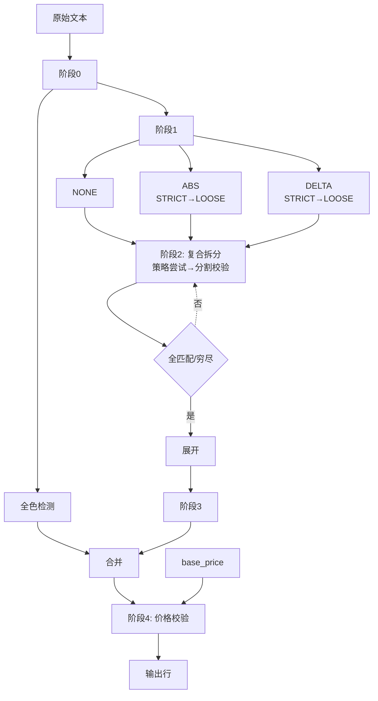

# Shop 四阶段处理逻辑对比总结

各 shop 清洗器的四阶段流水线（阶段1 匹配 → 阶段2 复合拆分 → 阶段3 转 specs → 阶段4 价格校验）对比分析。

---

## 处理流程图

### 图表详情

| 节点 | 说明 |
|------|------|
| **阶段0** | `normalize_text_stage0`：各 shop 取到原始文本后立即调用。Unicode NFKC、HTML 标签清理、减号 emoji→`-`、其他 emoji 删除、去控制字符 |
| **全色检测** | `detect_all_delta_unified`，内部用 `normalize_text_basic` 预处理；匹配「全色 ±金额」插入 delta_specs 首位 |
| **阶段1 匹配** | `match_tokens_generic`：各 shop 的 preprocessor 预处理后，用 `split_re` 分割 part；NONE / ABS / DELTA 均为各 shop 独立定义 |
| **两路归一化** | 彼此独立：全色固定 `normalize_text_basic`，阶段1用各 shop 的 preprocessor；不共享预处理结果 |
| **NONE / ABS / DELTA** | 依次尝试：NONE_RE（なし）、ABS_RE（￥金额）、DELTA_RE（±金额）；ABS 与 DELTA 均为 STRICT 优先、LOOSE 兜底 |
| **ABS LOOSE** | 公共 `ABS_RE_LOOSE_GENERIC`，放宽 label 字符集（日文片假名/汉字/连字符），与 DELTA LOOSE 分开便于独立修改 |
| **DELTA LOOSE** | 公共 `DELTA_RE_LOOSE_GENERIC`，放宽 label 字符集，兜底匹配非标准标签 |
| **阶段2 复合拆分** | `expand_match_tokens` → `split_composite_label_adaptive`；逐 token 处理，复合标签（如 `青/オレンジ`）按策略拆分 |
| **策略依次尝试** | 公共 `LABEL_SPLIT_STRATEGIES`：standard → with_semicolon → with_ampersand → with_pipe → aggressive；非各 shop 独立 |
| **分割→校验** | 按当前策略 regex 分割，`validate_split_labels` 校验子标签与 color_map；全匹配则停止，否则尝试下一策略；穷尽后用 best_result |
| **展开** | 子标签展开为多 token，各继承同一金额 |
| **阶段3 转 specs** | `match_tokens_to_specs` → deltas、abs_specs |
| **合并** | 全色插入 delta_specs 首位，与阶段3产出合并 |
| **阶段4 价格校验** | `resolve_color_prices`：≤0、>1.5×base、<0.5×base 时用 base_price |

**阶段1 各 shop 独立项**：`split_re`、NONE_RE、DELTA_RE（STRICT）、ABS_RE。  
**阶段1 LOOSE 公共项**：`ABS_RE_LOOSE_GENERIC`、`DELTA_RE_LOOSE_GENERIC` 分开定义，便于独立修改；默认均启用。  
**阶段2 公共项**：`LABEL_SPLIT_STRATEGIES`，所有 shop 共用。

---

## 一、流程概览

**阶段0**：各 shop 取到原始文本后立即调用 `normalize_text_stage0`（NFKC、HTML 清理、emoji 处理、去控制字符），再传入全色检测与阶段1。

| Shop | 店铺名 | 文本来源 | Fragment | 特殊预处理 |
|------|--------|----------|----------|------------|
| **shop2** | 海峡通信 | data5 | 单段 | +++/、→\n |
| **shop3** | 買取一丁目 | 减价1 | 单段 | — |
| **shop4** | モバイルミックス | data+data11 | 多行block | _collect_block_segments, 円/ 分割 |
| **shop7** | 買取ホムラ | data2(下一行) | 单行 | 下一行无价格=颜色行 |
| **shop9** | アキモバ | 買取価格+色・詳細等 | 合并2列 | _clean_color_text_shop9 |
| **shop11** | モバステ | caution_empty | 单段 | 去括号备注 |
| **shop12** | トゥインクル | 備考1 | 单段 | _clean_color_text_1_shop12（去開封行）|
| **shop14** | 買取楽園 | 减价条件×3列 | **多fragment** | 3列分别 match 后合并 |
| **shop15** | 買取当番 | price | 单段 | _clean_color_text_shop15（去掉行首基准价）|
| **shop16** | 携帯空間 | 買取価格 | 单段 | 换行→/，去基准价前缀 |
| **shop17** | ゲストモバイル | 色減額 | 单段 | _pick_unopened_section【未開封】 |

---

## 二、核心组件

### 2.1 阶段0 → 全色检测 + 阶段1 归一化

- **阶段0**：`normalize_text_stage0(text)` 在取到原始文本后立即调用，输出再传入全色检测与阶段1。包含：去控制字符、NFKC、HTML 标签清理、减号类 emoji→`-`、其他 emoji 删除
- **全色**：`detect_all_delta_unified(text, _ALL_DELTA_RE_shop*)`，内部固定 `normalize_text_basic`
- **阶段1**：`match_tokens_generic(text, preprocessor=...)`，preprocessor 各 shop 独立；两路不共享预处理
- **shop12 例外**：caller 先调 `_clean_color_text_1_shop12` 去開封行，再传入 stage1

| Shop | 阶段1 preprocessor | 备注 |
|------|-------------------|------|
| shop2,3,4,7,11,14,15 | `_clean_color_text_shop*` | — |
| shop9 | `_clean_color_text_shop9_single` | caller 合并两列后传 |
| shop12 | `_clean_color_text_shop12` | 输入已去開封行 |
| shop16 | `_preprocess_color_text_shop16` | 归一化 + 去行首基准价 |
| shop17 | `_preprocess_color_text_shop17` | pick_unopened + 归一化 + 色減額切分 |

### 2.2 SPLIT_TOKENS_RE（part 分割）

- **shop2–14**：字符类 + 备选格式，多含 `\n`；shop14 用 `\s*(?:...)\s*` 显式列举
- **shop15/16/17**：shop15 不含 \n、;，多 &/＆；shop16 不含 \n；shop17 字符类较简

详见各 shop 定义 `SPLIT_TOKENS_RE_shop*` / `LABEL_SPLIT_RE_shop*`。

### 2.3 正则模式 (NONE_RE / ABS_RE / DELTA_RE)

所有 shop 结构一致（label、sep、sign、amount 等）。STRICT 各 shop 独立；LOOSE 用公共 `ABS_RE_LOOSE_GENERIC`、`DELTA_RE_LOOSE_GENERIC`，默认启用。

**匹配顺序**：NONE_RE → ABS_RE → DELTA_RE → pending_labels（标签无金额时挂起，等下一 part 绑定）

### 2.4 format_hint 分支（DELTA_RE）

| sign | sep | hint |
|------|-----|------|
| 有 ± | — | FORMAT_HINT_SIGNED |
| 无，sep 为 - | — | FORMAT_HINT_SEP_MINUS |
| 无，sep 为 ： | — | FORMAT_HINT_COLON_PREFIX |
| 无 sign/sep | — | FORMAT_HINT_PLAIN_DIGITS |
| （ABS_RE） | — | FORMAT_HINT_AFTER_YEN |
| （NONE_RE） | — | FORMAT_HINT_NONE |

### 2.5 LOOSE fallback

ABS / DELTA 各自 `*_RE_LOOSE_GENERIC`，STRICT 未命中时兜底；参数 `use_abs_loose_fallback`、`use_delta_loose_fallback` 默认 True。与阶段2 自适应匹配互不替代。

### 2.6 自适应匹配（阶段2）

`expand_match_tokens` → `split_composite_label_adaptive`：复合标签按 `LABEL_SPLIT_STRATEGIES` 拆分（standard → semicolon → ampersand → pipe → aggressive），全匹配优先停止。全部 shop `enable_adaptive=True`。

---

## 三、基准价 (base_price) 来源

| Shop | 来源 |
|------|------|
| shop2 | extract_price_yen(data3) |
| shop3 | extract_price_yen(data5) |
| shop4 | `_find_base_price` 回溯上一行/上 3 行 |
| shop7 | extract_price_yen(data3) |
| shop9 | extract_price_yen(買取価格) |
| shop11 | extract_price_yen(price_unopened) |
| shop12 | extract_price_yen(買取価格) |
| shop14 | to_int_yen(price2) |
| shop15 | `_extract_base_price_at_start` 从 price 文本行首提取 |
| shop16 | `_extract_base_price_shop16` 从買取価格文本提取 |
| shop17 | extract_price_yen(新未開封品) |

---

## 四、阶段2 expand_match_tokens

全部 shop `enable_adaptive=True`。

---

## 五、阶段4 resolve_color_prices

**价格合理性校验**（`skip_non_positive=True` 全部启用）：最终价格 ≤0 或 ∉ [0.5×base, 1.5×base] → 用 base_price 替代，记 warning。

---

## 六、特有逻辑摘要

| Shop | 特有逻辑 |
|------|----------|
| shop2 | SIMfree+未開封过滤，cmap_filtered |
| shop4 | block 结构、`_find_base_price`、`_collect_block_segments`、`円/` 分割 |
| shop7 | 颜色行=下一行 data2 且无价格 |
| shop9 | 合并 2 列 |
| shop12 | `_clean_color_text_1_shop12` 去開封行 |
| shop14 | 3 列 fragment 分别 match 再合并 |
| shop15 | 去掉行首基准价，`_extract_base_price_at_start` |
| shop16 | 基础价从文本提取、去前缀 |
| shop17 | `_pick_unopened_section`【未開封】 |

---

## 七、统一性与建议

### 已统一

`match_tokens_generic` + `expand_match_tokens` + `match_tokens_to_specs` 流水线；`detect_all_delta_unified`、`_label_matches_color_unified`、NONE/ABS/DELTA 结构、LOOSE fallback 均统一。

### 可改进

**SPLIT_TOKENS_RE**：各 shop 略有差异，可按数据格式收敛到少数几种。

---

## 八、输出去重（全 shop 通用）

`run_cleaner` 在调用各 shop 清洗器后，对输出统一执行 `dedupe_output_keep_latest`，对所有 shop（A/B/C 类）生效。

| 项目 | 说明 |
|------|------|
| **位置** | `registry.run_cleaner` → `cleaner_tools.dedupe_output_keep_latest` |
| **去重键** | `(part_number, shop_name)`（若无 shop_name 则仅 part_number） |
| **保留策略** | 按 `recorded_at`（time-scraped）升序排列，保留每组最后一行（即最新时间戳） |
| **影响** | 同一 (pn, shop) 因输入重复（如多次抓取 time-scraped 不同）而产生多行时，仅保留最新一条 |

**示例**：shop13（家電市場）输入 312 行，清洗后 64 行（43 唯一 PN × 部分重复），去重后 43 行。
