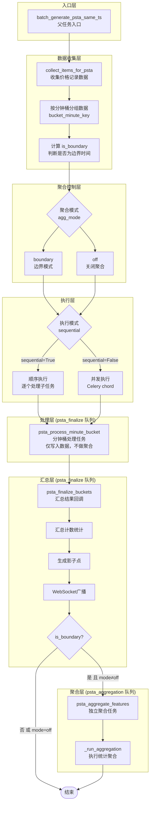
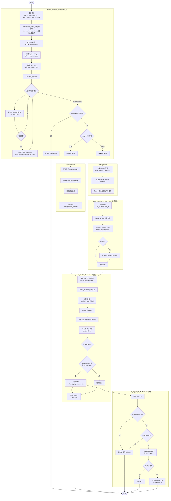
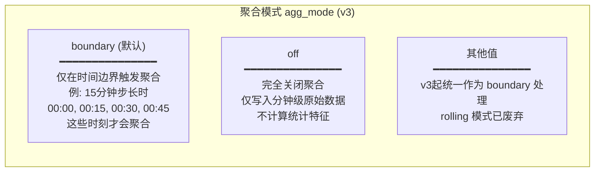
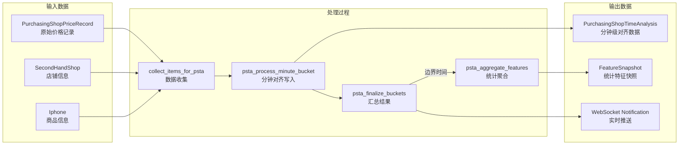
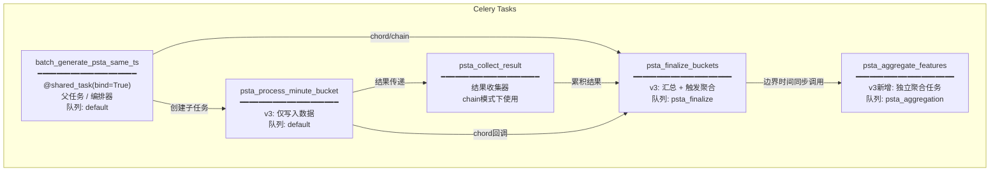
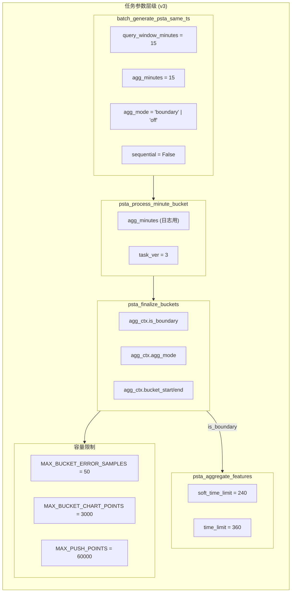

# Timestamp Alignment Task 流程图

本文档描述 `timestamp_alignment_task.py` 中的任务执行流程。

> **v3 重大变更**（2026-01）：
> - 聚合逻辑从子任务移至 `psta_finalize_buckets`
> - 新增独立聚合任务 `psta_aggregate_features`
> - 新增专用队列 `psta_finalize` 和 `psta_aggregation`
> - 简化 `agg_mode`：`off` 禁用聚合，其他值统一为边界模式
> - 废弃参数：`do_agg`, `agg_start_iso`, `force_agg`, `chunk_size`

## 整体架构图（v3）



## 详细流程图（v3）



## 聚合模式详解（v3简化）



## 数据流图（v3）



## 任务关系图（v3）



## 关键函数说明（v3）

| 函数名 | 说明 | v3 变更 |
|--------|------|---------|
| `batch_generate_psta_same_ts` | 父任务入口，负责数据收集、分桶、任务编排 | 计算 is_boundary，不再传递 do_agg/agg_start_iso |
| `psta_process_minute_bucket` | 子任务，写入分钟数据 | 移除聚合逻辑，仅做数据写入 |
| `psta_finalize_buckets` | 回调任务，汇总结果并触发聚合 | 新增聚合任务调用逻辑 |
| `psta_aggregate_features` | **v3新增** 独立聚合任务 | - |
| `psta_collect_result` | chain模式下累积子任务结果 | 无变化 |
| `guard_params` | 参数守卫，类型校验、版本检查 | 无变化 |
| `_process_minute_rows` | 处理并写入分钟级数据 | 无变化 |
| `_run_aggregation` | 执行统计聚合计算 | 由 psta_aggregate_features 调用 |

## 执行模式对比

| 特性 | 顺序执行 (sequential=True) | 并发执行 (sequential=False) |
|------|---------------------------|---------------------------|
| 执行方式 | `subtask.apply().get()` | Celery `chord` |
| 资源占用 | 低，单worker | 高，多worker并行 |
| 执行速度 | 较慢 | 较快 |
| 错误处理 | 逐个捕获，继续执行 | chord失败可能中断 |
| 进度通知 | 每个桶完成后通知 | 仅最终结果通知 |
| 适用场景 | 调试、资源受限环境 | 生产环境、大数据量 |

---

## 默认数字参数汇总（v3）

### 1. 任务版本控制

| 参数名 | 默认值 | 说明 |
|--------|--------|------|
| `TASK_VER_PSTA` | `3` | 当前任务版本号（v3） |
| `MIN_ACCEPTED_TASK_VER` | `0` | 最低可接受的任务版本 |

### 2. 父任务入口参数 (`batch_generate_psta_same_ts`)

| 参数名 | 默认值 | 说明 |
|--------|--------|------|
| `query_window_minutes` | `15` | 数据查询窗口（分钟） |
| `agg_minutes` | `15` | 聚合步长（分钟） |
| `agg_mode` | `"boundary"` | 聚合模式：`off` 禁用，其他 = 边界模式 |
| `sequential` | `False` | 顺序执行模式（默认并发） |
| ~~`chunk_size`~~ | - | 已废弃 |
| ~~`force_agg`~~ | - | 已废弃 |

### 3. 子任务参数 (`psta_process_minute_bucket`)

| 参数名 | 默认值 | 说明 |
|--------|--------|------|
| `agg_minutes` | `1` | 保留用于日志/调试 |
| ~~`do_agg`~~ | - | 已废弃（v3移除） |
| ~~`agg_start_iso`~~ | - | 已废弃（v3移除） |

### 4. 聚合任务参数 (`psta_aggregate_features`) - v3新增

| 参数名 | 说明 |
|--------|------|
| `ts_iso` | 时间戳 ISO 格式 |
| `job_id` | 任务 ID |
| `agg_ctx` | 聚合上下文字典 |
| `task_ver` | 任务版本号 |

### 5. 数据容量限制

| 常量名 | 默认值 | 说明 |
|--------|--------|------|
| `MAX_BUCKET_ERROR_SAMPLES` | `50` | 单桶保留的错误明细条数上限 |
| `MAX_BUCKET_CHART_POINTS` | `3000` | 单桶打包给回调聚合用的图表点上限 |
| `MAX_PUSH_POINTS` | `60000` | 本次广播给前端的真实点总上限 |

### 6. 价格验证参数

| 常量名 | 默认值 | 说明 |
|--------|--------|------|
| `PRICE_LOOKBACK_MINUTES` | `30` | 动态价格区间：向前查询的时间窗口（分钟） |
| `PRICE_TOLERANCE_RATIO` | `0.10` | 动态价格区间：容差比例（±10%） |
| `PRICE_MIN_SAMPLES` | `3` | 计算参考价格所需的最少样本数 |
| `PRICE_FALLBACK_MIN` | `100000` | 数据不足时的后备最小值 |
| `PRICE_FALLBACK_MAX` | `350000` | 数据不足时的后备最大值 |

### 7. 聚合计算参数

| 参数名 | 默认值 | 说明 |
|--------|--------|------|
| `WATERMARK_MINUTES` | `5` | 水位线（分钟）：超过此时间的数据标记为 `is_final=True` |
| `AGE_CAP_MIN` | `12.0` | 时效权重：超过此分钟数的数据不计入加权 |
| `RECENCY_HALF_LIFE_MIN` | `6.0` | 时效权重：指数半衰期（分钟） |

### 8. 任务超时配置（v3新增）

| 任务 | soft_time_limit | time_limit |
|------|-----------------|------------|
| `psta_finalize_buckets` | 240s | 360s |
| `psta_aggregate_features` | 240s | 360s |

---

## Celery 队列配置（v3）

| 队列名称 | 用途 | Worker 并发数 |
|---------|------|--------------|
| `default` | 默认队列、父任务、子任务 | 4 |
| `psta_finalize` | finalize 回调任务 | 2 |
| `psta_aggregation` | 聚合任务 | 4 |
| `webscraper` | 网页爬虫任务 | 2 |
| `automl_preprocessing` | AutoML 预处理 | 2 |
| `automl_cause_effect` | AutoML 因果分析 | 2 |
| `automl_impact` | AutoML 影响量化 | 2 |

**Worker 启动示例：**
```bash
# PSTA Finalize Worker
celery -A YamagotiProjects worker -Q psta_finalize -l info -c 2

# PSTA Aggregation Worker
celery -A YamagotiProjects worker -Q psta_aggregation -l info -c 4
```

---

## 参数配置示意图（v3）



## 环境变量配置

| 环境变量 / Settings | 默认值 | 说明 |
|---------------------|--------|------|
| `PSTA_PARAM_STRICT` | `"warn"` | 参数严格度：`ignore` / `warn` / `error` |
| `PSTA_MIN_ACCEPTED_VER` | `0` | 最低可接受的任务版本 |
| `settings.PSTA_AGE_CAP_MIN` | `12.0` | 时效权重年龄上限（分钟） |
| `settings.PSTA_RECENCY_HALF_LIFE_MIN` | `6.0` | 时效衰减半衰期（分钟） |
| `settings.PSTA_RECENCY_DECAY` | `"exp"` | 时效衰减模式 |
| `settings.IPHONE_OFFICIAL_PRICES` | `{}` | iPhone 官方价格字典 |

---

## v3 迁移指南

### 废弃参数处理

调用 `batch_generate_psta_same_ts` 时：
- `force_agg` 参数会被忽略并记录警告
- `chunk_size` 参数会被忽略并记录警告

调用 `psta_process_minute_bucket` 时：
- `do_agg` 参数会被忽略并记录警告
- `agg_start_iso` 参数会被忽略并记录警告

### 新增 Worker 配置

需要在 docker-compose.yml 中添加：
```yaml
celery_worker_psta_finalize:
  command: celery -A YamagotiProjects worker -Q psta_finalize -l info -c 2

celery_worker_psta_aggregation:
  command: celery -A YamagotiProjects worker -Q psta_aggregation -l info -c 4
```

### 聚合模式变化

| 原模式 | v3 行为 |
|--------|---------|
| `boundary` | 保持不变 |
| `rolling` | 自动转为 `boundary` |
| `off` | 保持不变 |
